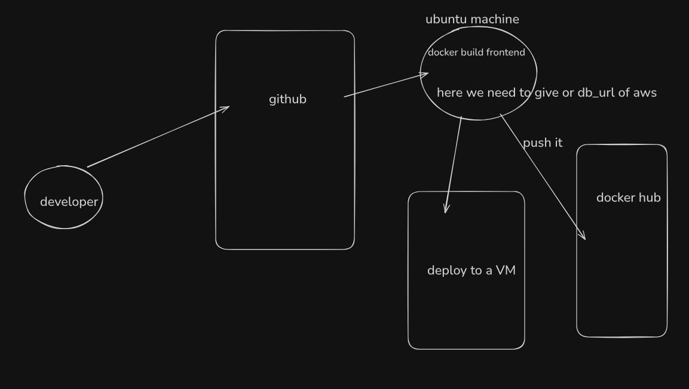

# Learning


1.)you should not update or migrate the db in ci-cd pipeline so put that bash code in package.json

2.)for frontend we first need to do bun run build so that tsx files get convert to ts files for backend we dont need to do this as bun can run ts files directly

3.) in production we do bun run start to start the nextjs app not bun run dev , so before bun run start we need to do bun run build

4.)static pages get created at build time (this means that page will now not be generated again even if backend sends data to it) this is great for SEO and landing pages but its con is you have to rebuild the app if you want to add something new to that page

5.)the solution is , in next.js you can force a page to be dynamically generated using 
```
export const dynamic = 'force-dynamic'

```
or add a revalidate
```
export const revalidate = 60
```


